

# UNIVERSIDAD DE SAN CARLOS DE GUATEMALA
## FACULTAD DE INGENIERÍA
### ESCUELA DE CIENCIAS Y SISTEMAS
### REDES DE COMPUTADORAS 1

  

# MANUAL TÉCNICO
## PRÁCTICA 1

  

**David Norberto Fabro Guzmán**  
**2023074999**  
**Sección A**  

  

**Guatemala, 18 de febrero de 2026**

---

 

# INTRODUCCIÓN

El presente manual técnico tiene como propósito documentar de manera detallada la implementación y configuración de la Práctica 1 del curso de Redes de Computadoras 1. Este documento proporciona información técnica esencial sobre la topología de red diseñada, los dispositivos utilizados, las configuraciones aplicadas y los protocolos implementados.

El manual está orientado a servir como guía de referencia para la comprensión, mantenimiento y posible extensión de la red configurada. Se incluyen detalles sobre direccionamiento IP, configuración de dispositivos, VLANs, enrutamiento y demás aspectos técnicos relevantes que permitan replicar o modificar la infraestructura de red presentada.

A través de este documento, se busca facilitar la comprensión de los conceptos aplicados y proporcionar una base sólida para la resolución de problemas y optimización de la red.

 

---

 

# TABLA DE DIRECCIONAMIENTO IP

<table border="1" style="border-collapse: collapse; width: 100%;">
  <thead>
    <tr>
      <th style="text-align: center; padding: 8px; background-color: #f2f2f2;">DEPARTAMENTO</th>
      <th style="text-align: center; padding: 8px; background-color: #f2f2f2;">IP</th>
      <th style="text-align: center; padding: 8px; background-color: #f2f2f2;">Dispositivo</th>
    </tr>
  </thead>
  <tbody>
    <!-- Recepción -->
    <tr>
      <td rowspan="12" style="text-align: center; padding: 8px; vertical-align: middle;">Recepción</td>
      <td style="padding: 8px;">192.178.99.3</td>
      <td style="padding: 8px;">PC11</td>
    </tr>
    <tr>
      <td style="padding: 8px;">192.178.99.2</td>
      <td style="padding: 8px;">PC12</td>
    </tr>
    <tr>
      <td style="padding: 8px;">192.178.99.5</td>
      <td style="padding: 8px;">PC13</td>
    </tr>
    <tr>
      <td style="padding: 8px;">192.178.99.4</td>
      <td style="padding: 8px;">PC14</td>
    </tr>
    <tr>
      <td style="padding: 8px;">192.178.99.1</td>
      <td style="padding: 8px;">PC15</td>
    </tr>
    <tr>
      <td style="padding: 8px;">192.178.99.9</td>
      <td style="padding: 8px;">PC16</td>
    </tr>
    <tr>
      <td style="padding: 8px;">192.178.99.6</td>
      <td style="padding: 8px;">PC17</td>
    </tr>
    <tr>
      <td style="padding: 8px;">192.178.99.7</td>
      <td style="padding: 8px;">PC18</td>
    </tr>
    <tr>
      <td style="padding: 8px;">192.178.99.12</td>
      <td style="padding: 8px;">PC19</td>
    </tr>
    <tr>
      <td style="padding: 8px;">192.178.99.11</td>
      <td style="padding: 8px;">PC20</td>
    </tr>
    <tr>
      <td style="padding: 8px;">192.178.99.8</td>
      <td style="padding: 8px;">PC21</td>
    </tr>
    <tr>
      <td style="padding: 8px;">192.178.99.10</td>
      <td style="padding: 8px;">Server0</td>
    </tr>
    <!-- Contabilidad -->
    <tr>
      <td rowspan="8" style="text-align: center; padding: 8px; vertical-align: middle;">Contabilidad</td>
      <td style="padding: 8px;">192.178.99.23</td>
      <td style="padding: 8px;">PC22</td>
    </tr>
    <tr>
      <td style="padding: 8px;">192.178.99.24</td>
      <td style="padding: 8px;">PC23</td>
    </tr>
    <tr>
      <td style="padding: 8px;">192.178.99.28</td>
      <td style="padding: 8px;">PC24</td>
    </tr>
    <tr>
      <td style="padding: 8px;">192.178.99.26</td>
      <td style="padding: 8px;">PC25</td>
    </tr>
    <tr>
      <td style="padding: 8px;">192.178.99.30</td>
      <td style="padding: 8px;">PC26</td>
    </tr>
    <tr>
      <td style="padding: 8px;">192.178.99.29</td>
      <td style="padding: 8px;">PC27</td>
    </tr>
    <tr>
      <td style="padding: 8px;">192.178.99.27</td>
      <td style="padding: 8px;">PC28</td>
    </tr>
    <tr>
      <td style="padding: 8px;">192.178.99.25</td>
      <td style="padding: 8px;">PC29</td>
    </tr>
    <!-- Reuniones -->
    <tr>
      <td rowspan="5" style="text-align: center; padding: 8px; vertical-align: middle;">Reuniones</td>
      <td style="padding: 8px;">192.178.99.22</td>
      <td style="padding: 8px;">PC30</td>
    </tr>
    <tr>
      <td style="padding: 8px;">192.178.99.18</td>
      <td style="padding: 8px;">PC31</td>
    </tr>
    <tr>
      <td style="padding: 8px;">192.178.99.19</td>
      <td style="padding: 8px;">PC32</td>
    </tr>
    <tr>
      <td style="padding: 8px;">192.178.99.21</td>
      <td style="padding: 8px;">PC33</td>
    </tr>
    <tr>
      <td style="padding: 8px;">192.178.99.20</td>
      <td style="padding: 8px;">PC34</td>
    </tr>
    <!-- Legal -->
    <tr>
      <td rowspan="5" style="text-align: center; padding: 8px; vertical-align: middle;">Legal</td>
      <td style="padding: 8px;">192.178.99.15</td>
      <td style="padding: 8px;">PC35</td>
    </tr>
    <tr>
      <td style="padding: 8px;">192.178.99.14</td>
      <td style="padding: 8px;">PC36</td>
    </tr>
    <tr>
      <td style="padding: 8px;">192.178.99.16</td>
      <td style="padding: 8px;">PC37</td>
    </tr>
    <tr>
      <td style="padding: 8px;">192.178.99.17</td>
      <td style="padding: 8px;">PC38</td>
    </tr>
    <tr>
      <td style="padding: 8px;">192.178.99.13</td>
      <td style="padding: 8px;">PC39</td>
    </tr>
    <!-- Arqui -->
    <tr>
      <td rowspan="6" style="text-align: center; padding: 8px; vertical-align: middle;">Arqui</td>
      <td style="padding: 8px;">192.178.99.36</td>
      <td style="padding: 8px;">PC40</td>
    </tr>
    <tr>
      <td style="padding: 8px;">192.178.99.31</td>
      <td style="padding: 8px;">PC41</td>
    </tr>
    <tr>
      <td style="padding: 8px;">192.178.99.35</td>
      <td style="padding: 8px;">Lap0</td>
    </tr>
    <tr>
      <td style="padding: 8px;">192.178.99.34</td>
      <td style="padding: 8px;">Lap1</td>
    </tr>
    <tr>
      <td style="padding: 8px;">192.178.99.33</td>
      <td style="padding: 8px;">Lap2</td>
    </tr>
    <tr>
      <td style="padding: 8px;">192.178.99.32</td>
      <td style="padding: 8px;">Lap3</td>
    </tr>
    <!-- Planos -->
    <tr>
      <td rowspan="5" style="text-align: center; padding: 8px; vertical-align: middle;">Planos</td>
      <td style="padding: 8px;">192.178.99.38</td>
      <td style="padding: 8px;">PC42</td>
    </tr>
    <tr>
      <td style="padding: 8px;">192.178.99.37</td>
      <td style="padding: 8px;">PC43</td>
    </tr>
    <tr>
      <td style="padding: 8px;">192.178.99.41</td>
      <td style="padding: 8px;">PC44</td>
    </tr>
    <tr>
      <td style="padding: 8px;">192.178.99.39</td>
      <td style="padding: 8px;">Lap4</td>
    </tr>
    <tr>
      <td style="padding: 8px;">192.178.99.40</td>
      <td style="padding: 8px;">Lap5</td>
    </tr>
    <!-- Urbanización -->
    <tr>
      <td rowspan="6" style="text-align: center; padding: 8px; vertical-align: middle;">Urbanización</td>
      <td style="padding: 8px;">192.178.99.44</td>
      <td style="padding: 8px;">PC45</td>
    </tr>
    <tr>
      <td style="padding: 8px;">192.178.99.45</td>
      <td style="padding: 8px;">PC46</td>
    </tr>
    <tr>
      <td style="padding: 8px;">192.178.99.43</td>
      <td style="padding: 8px;">PC47</td>
    </tr>
    <tr>
      <td style="padding: 8px;">192.178.99.46</td>
      <td style="padding: 8px;">Lap6</td>
    </tr>
    <tr>
      <td style="padding: 8px;">192.178.99.47</td>
      <td style="padding: 8px;">Lap7</td>
    </tr>
    <tr>
      <td style="padding: 8px;">192.178.99.42</td>
      <td style="padding: 8px;">Server1</td>
    </tr>
    <!-- Dirección -->
    <tr>
      <td rowspan="4" style="text-align: center; padding: 8px; vertical-align: middle;">Dirección</td>
      <td style="padding: 8px;">192.178.99.48</td>
      <td style="padding: 8px;">PC48</td>
    </tr>
    <tr>
      <td style="padding: 8px;">192.178.99.50</td>
      <td style="padding: 8px;">PC49</td>
    </tr>
    <tr>
      <td style="padding: 8px;">192.178.99.49</td>
      <td style="padding: 8px;">Lap8</td>
    </tr>
    <tr>
      <td style="padding: 8px;">192.178.99.51</td>
      <td style="padding: 8px;">Lap9</td>
    </tr>
    <!-- Ingeniería -->
    <tr>
      <td rowspan="6" style="text-align: center; padding: 8px; vertical-align: middle;">Ingeniería</td>
      <td style="padding: 8px;">192.178.99.56</td>
      <td style="padding: 8px;">Lap10</td>
    </tr>
    <tr>
      <td style="padding: 8px;">192.178.99.55</td>
      <td style="padding: 8px;">Lap11</td>
    </tr>
    <tr>
      <td style="padding: 8px;">192.178.99.58</td>
      <td style="padding: 8px;">Lap12</td>
    </tr>
    <tr>
      <td style="padding: 8px;">192.178.99.59</td>
      <td style="padding: 8px;">Lap13</td>
    </tr>
    <tr>
      <td style="padding: 8px;">192.178.99.60</td>
      <td style="padding: 8px;">Lap14</td>
    </tr>
    <tr>
      <td style="padding: 8px;">192.178.99.57</td>
      <td style="padding: 8px;">Server2</td>
    </tr>
    <!-- Servidores -->
    <tr>
      <td rowspan="3" style="text-align: center; padding: 8px; vertical-align: middle;">Servidores</td>
      <td style="padding: 8px;">192.178.99.52</td>
      <td style="padding: 8px;">Server3</td>
    </tr>
    <tr>
      <td style="padding: 8px;">192.178.99.53</td>
      <td style="padding: 8px;">Server4</td>
    </tr>
    <tr>
      <td style="padding: 8px;">192.178.99.54</td>
      <td style="padding: 8px;">Server5</td>
    </tr>
  </tbody>
</table>

 

---

 

# PRUEBAS DE PING

## 1. Prueba 1
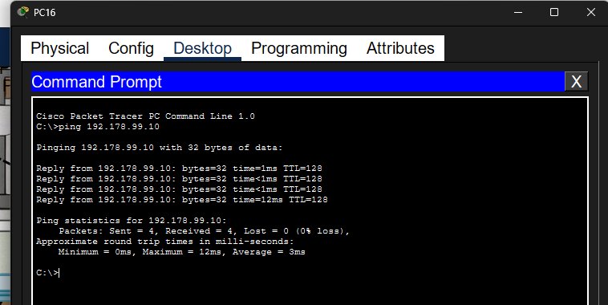

## 2. Prueba 2
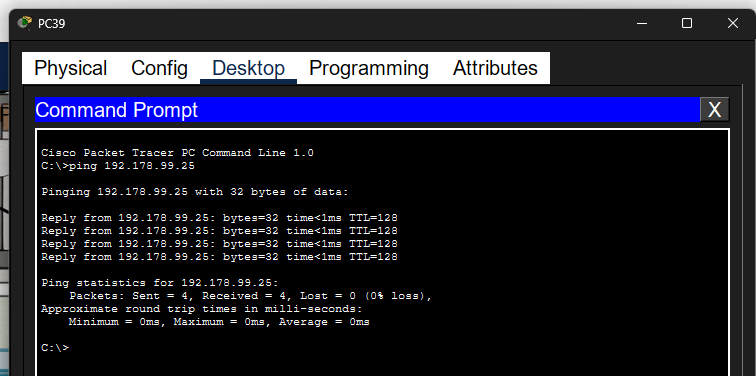

## 3. Prueba 3
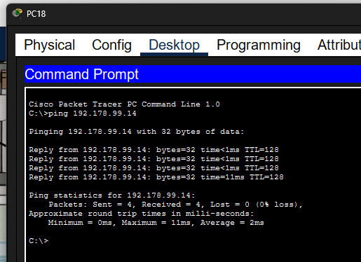

## 4. Prueba 4
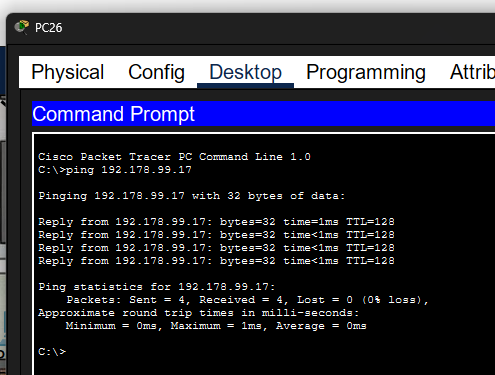

## 5. Prueba 5
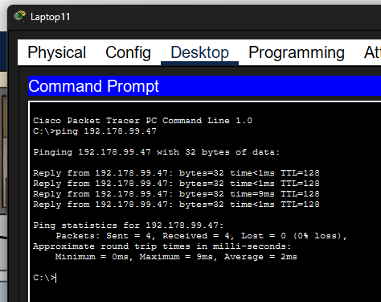

## 6. Prueba 6
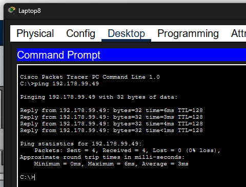

## 7. Prueba 7
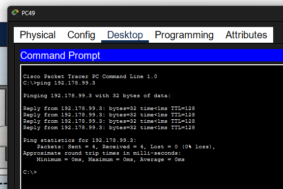

## 8. Prueba 8
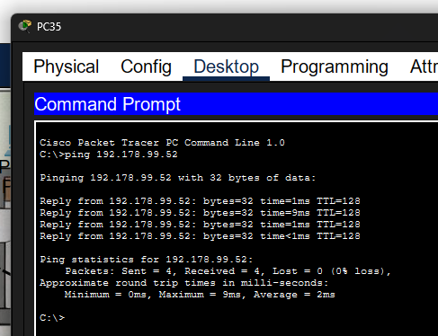

## 9. Prueba 9
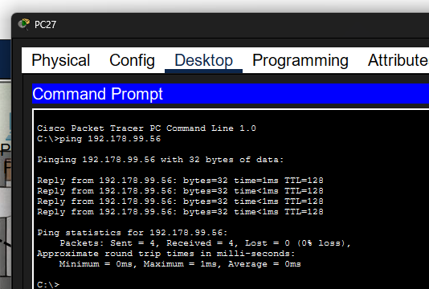

## 10. Prueba 10
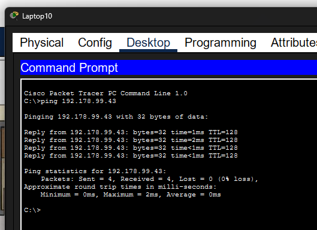

 

---

 

# PRUEBAS EN TIEMPO REAL

## 1. Prueba en Tiempo Real 1
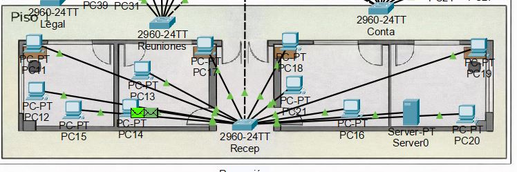

## 2. Prueba en Tiempo Real 2
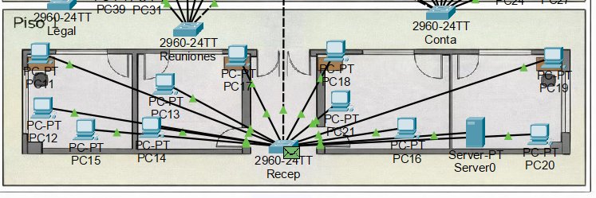

## 3. Prueba en Tiempo Real 3
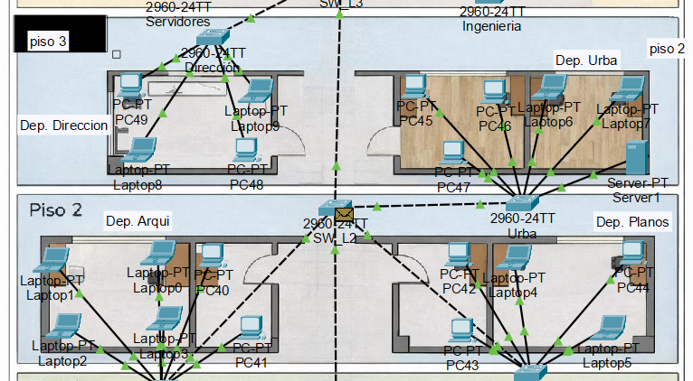

## 4. Prueba en Tiempo Real 4
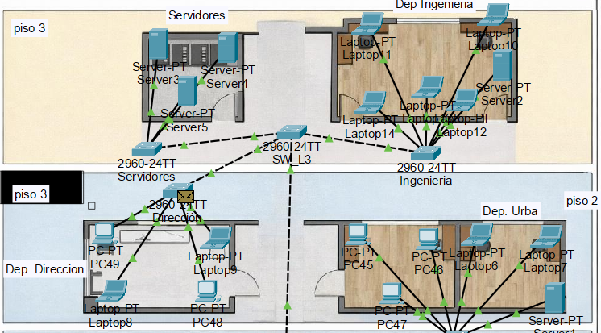

## 5. Prueba en Tiempo Real 5
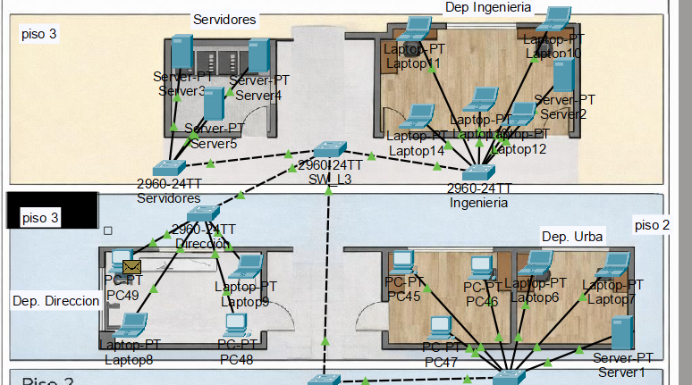

## 6. Prueba en Tiempo Real 6
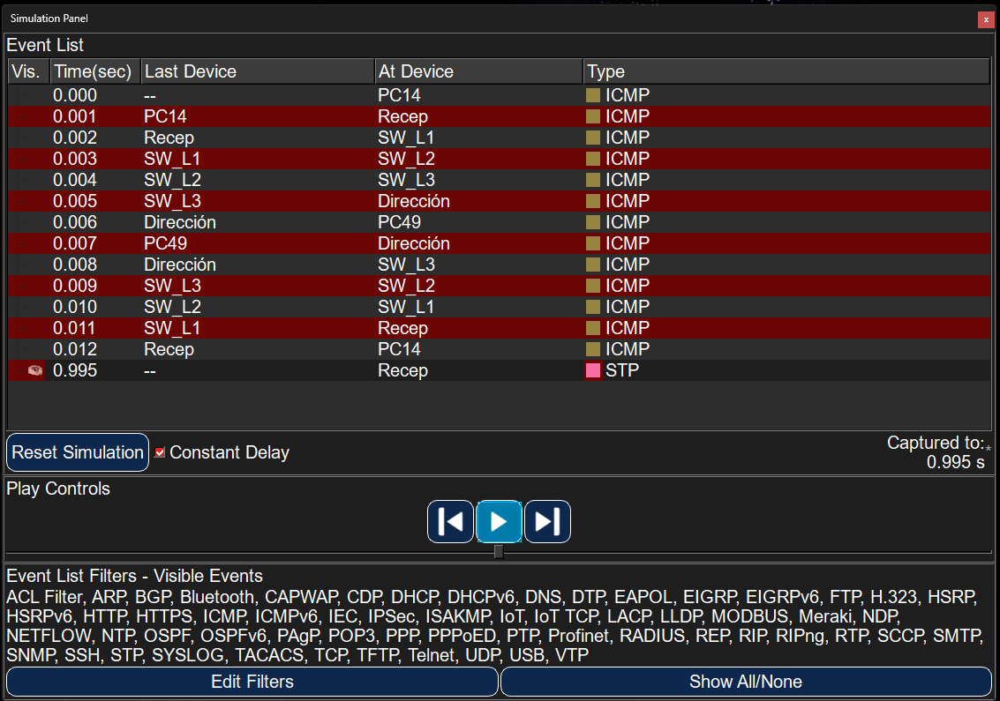

 

---
