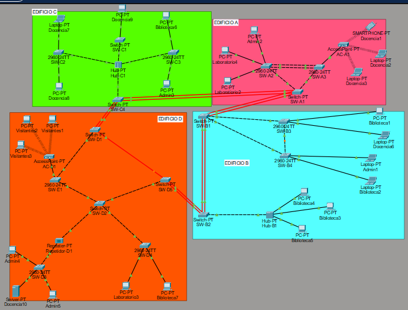
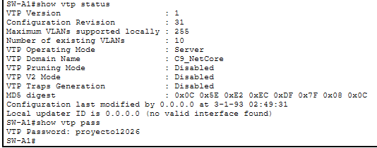
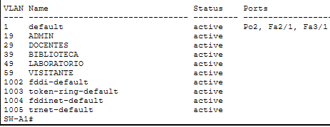
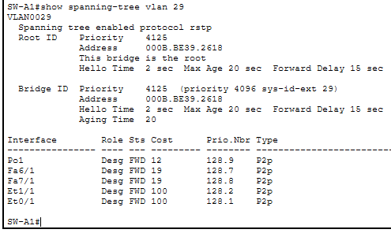
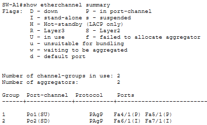
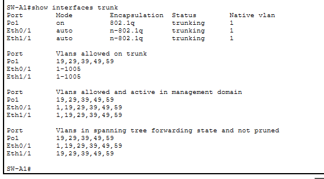
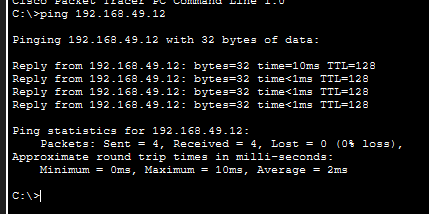
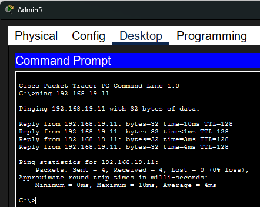

# Manual de Documentación — NetCore Academy
**Carnet:** 99 | **Dominio VTP:** C9_NetCore | **STP:** Rapid-PVST | **EtherChannel fibra:** PAgP | **EtherChannel UTP:** LACP

---

## 1. Topología General del Campus


---


**Resumen de dominios de colisión por tipo:**

- **Conmutados (1 por puerto):** Todos los puertos de switches 2960-24TT y Switch-PT → cada dispositivo tiene su propio dominio
- **Compartidos:** Hub-C1 (Edificio C) = 1 dominio para 3 switches + SW-C4 | Hub-B1 (Edificio B) = 1 dominio para 3 PCs | Repeater-D1 (Edificio D) = 1 dominio entre SW-D2 y SW-D3

---

## 2. Tabla de Dominios de Broadcast


| VLAN | Nombre | Dominio de Broadcast | Dispositivos |
|------|--------|---------------------|-------------|
| 19 | ADMIN | Todos los dispositivos de VLAN 19 en cualquier edificio | Admin2 (A), Admin1 (B), Admin3 (C), Admin4 (D), Admin5 (D) |
| 29 | DOCENTES | Todos los dispositivos de VLAN 29 en cualquier edificio | Docencia1-3 vía AP (A), Docencia6 (B), Docencia7-9 (C), Docencia10/Server (D), Smartphone (A) |
| 39 | BIBLIOTECA | Todos los dispositivos de VLAN 39 en cualquier edificio | Biblioteca1-5 (B), Biblioteca6 (C), Biblioteca7 (D) |
| 49 | LABORATORIO | Todos los dispositivos de VLAN 49 en cualquier edificio | Laboratorio2, Laboratorio4 (A), Laboratorio3 (D) |
| 59 | VISITANTE | Todos los dispositivos de VLAN 59 en cualquier edificio | Visitantes1-3 vía AP AC-D1 (D) |


---

## 3. Tabla de VLANs

| VLAN ID | Nombre | Área | Red | Máscara | Rango de Hosts | Broadcast |
|---------|--------|------|-----|---------|----------------|-----------|
| 19 | ADMIN | Administración | 192.168.19.0 | /24 | 192.168.19.1 – .254 | 192.168.19.255 |
| 29 | DOCENTES | Docencia | 192.168.29.0 | /24 | 192.168.29.1 – .254 | 192.168.29.255 |
| 39 | BIBLIOTECA | Biblioteca | 192.168.39.0 | /24 | 192.168.39.1 – .254 | 192.168.39.255 |
| 49 | LABORATORIO | Laboratorio de Redes | 192.168.49.0 | /24 | 192.168.49.1 – .254 | 192.168.49.255 |
| 59 | VISITANTE | Visitantes | 192.168.59.0 | /24 | 192.168.59.1 – .254 | 192.168.59.255 |

---

## 4. Tabla de Direcciones IP por Dispositivo

| Edificio | Dispositivo | VLAN | Dirección IP | Máscara | Gateway* |
|----------|------------|------|-------------|---------|---------|
| A | PC-Laboratorio4 | 49 | 192.168.49.11 | 255.255.255.0 | 192.168.49.1 |
| A | PC-Laboratorio2 | 49 | 192.168.49.12 | 255.255.255.0 | 192.168.49.1 |
| A | PC-Admin2 | 19 | 192.168.19.11 | 255.255.255.0 | 192.168.19.1 |
| A | Laptop-Docencia1 (Wi-Fi) | 29 | 192.168.29.11 | 255.255.255.0 | 192.168.29.1 |
| A | Laptop-Docencia2 (Wi-Fi) | 29 | 192.168.29.12 | 255.255.255.0 | 192.168.29.1 |
| A | Laptop-Docencia3 (Wi-Fi) | 29 | 192.168.29.13 | 255.255.255.0 | 192.168.29.1 |
| A | Smartphone-Docencia1 (Wi-Fi) | 29 | 192.168.29.14 | 255.255.255.0 | 192.168.29.1 |
| B | PC-Biblioteca1 | 39 | 192.168.39.11 | 255.255.255.0 | 192.168.39.1 |
| B | Laptop-Docencia6 | 29 | 192.168.29.21 | 255.255.255.0 | 192.168.29.1 |
| B | Laptop-Admin1 | 19 | 192.168.19.21 | 255.255.255.0 | 192.168.19.1 |
| B | Laptop-Biblioteca2 | 39 | 192.168.39.12 | 255.255.255.0 | 192.168.39.1 |
| B | PC-Biblioteca3 (Hub) | 39 | 192.168.39.13 | 255.255.255.0 | 192.168.39.1 |
| B | PC-Biblioteca4 (Hub) | 39 | 192.168.39.14 | 255.255.255.0 | 192.168.39.1 |
| B | PC-Biblioteca5 (Hub) | 39 | 192.168.39.15 | 255.255.255.0 | 192.168.39.1 |
| C | Laptop-Docencia7 | 29 | 192.168.29.31 | 255.255.255.0 | 192.168.29.1 |
| C | PC-Docencia8 | 29 | 192.168.29.32 | 255.255.255.0 | 192.168.29.1 |
| C | PC-Docencia9 | 29 | 192.168.29.33 | 255.255.255.0 | 192.168.29.1 |
| C | PC-Biblioteca6 | 39 | 192.168.39.31 | 255.255.255.0 | 192.168.39.1 |
| C | PC-Admin3 | 19 | 192.168.19.31 | 255.255.255.0 | 192.168.19.1 |
| D | PC-Admin4 | 19 | 192.168.19.41 | 255.255.255.0 | 192.168.19.1 |
| D | PC-Admin5 | 19 | 192.168.19.42 | 255.255.255.0 | 192.168.19.1 |
| D | Server-Docencia10 | 29 | 192.168.29.41 | 255.255.255.0 | 192.168.29.1 |
| D | PC-Laboratorio3 | 49 | 192.168.49.31 | 255.255.255.0 | 192.168.49.1 |
| D | PC-Biblioteca7 | 39 | 192.168.39.41 | 255.255.255.0 | 192.168.39.1 |
| D | PC-Visitantes1 (Wi-Fi) | 59 | 192.168.59.11 | 255.255.255.0 | 192.168.59.1 |
| D | PC-Visitantes2 (Wi-Fi) | 59 | 192.168.59.12 | 255.255.255.0 | 192.168.59.1 |
| D | PC-Visitantes3 (Wi-Fi) | 59 | 192.168.59.13 | 255.255.255.0 | 192.168.59.1 |

*No existe routing inter-VLAN. El gateway se configura en el host pero no tiene respuesta.

---

## 5. Comandos Utilizados por Dispositivo

### 5.1 SW-A1 — VTP Server / Root Bridge

```
enable
configure terminal
hostname SW-A1
banner motd #
Bienvenido a Edificio A - NETCORE_99
#
vtp mode server
vtp domain C9_NetCore
vtp version 2
vlan 19
 name ADMIN
vlan 29
 name DOCENTES
vlan 39
 name BIBLIOTECA
vlan 49
 name LABORATORIO
vlan 59
 name VISITANTE
exit
spanning-tree mode rapid-pvst
spanning-tree vlan 19,29,39,49,59 priority 4096

! Trunks hacia SW-A2 y SW-A3 (GigabitEthernet)
interface GigabitEthernet0/1
 switchport mode trunk
 switchport trunk allowed vlan 19,29,39,49,59
 no shutdown
exit
interface GigabitEthernet0/2
 switchport mode trunk
 switchport trunk allowed vlan 19,29,39,49,59
 no shutdown
exit

! EtherChannel hacia SW-B1 (PAgP - fibra)
interface range FastEthernet[X]/1 - [X]/2
 switchport mode trunk
 switchport trunk allowed vlan 19,29,39,49,59
 channel-group 1 mode desirable
 no shutdown
exit
interface Port-channel1
 switchport mode trunk
 switchport trunk allowed vlan 19,29,39,49,59
 no shutdown
exit

! EtherChannel hacia SW-C4 (PAgP - fibra)
interface range FastEthernet[Y]/1 - [Y]/2
 switchport mode trunk
 switchport trunk allowed vlan 19,29,39,49,59
 channel-group 2 mode desirable
 no shutdown
exit
interface Port-channel2
 switchport mode trunk
 switchport trunk allowed vlan 19,29,39,49,59
 no shutdown
exit

! Contraseña VTP (al final de toda la configuración)
vtp password proyecto12026
end
write memory
```

### 5.2 SW-## — VTP Client

```
enable
configure terminal
hostname SW-A2
vtp mode client
vtp domain C9_NetCore
vtp version 2
spanning-tree mode rapid-pvst

! Trunk hacia SW-A1
interface GigabitEthernet0/1
 switchport mode trunk
 switchport trunk allowed vlan 19,29,39,49,59
 no shutdown
exit

! EtherChannel hacia SW-A3 (LACP - UTP)
interface GigabitEthernet0/2
 switchport mode trunk
 switchport trunk allowed vlan 19,29,39,49,59
 channel-group 1 mode active
 no shutdown
exit
interface Port-channel1
 switchport mode trunk
 switchport trunk allowed vlan 19,29,39,49,59
 no shutdown
exit

! Puertos de acceso
interface FastEthernet0/1
 switchport mode access
 switchport access vlan 49
 no shutdown
exit
interface FastEthernet0/2
 switchport mode access
 switchport access vlan 49
 no shutdown
exit
interface FastEthernet0/3
 switchport mode access
 switchport access vlan 19
 no shutdown
exit

vtp password proyecto12026
end
write memory
```


## 8. Comandos de Verificación

### VTP
```
show vtp status          ! Verifica modo, dominio, revisión
show vtp password        ! Verifica contraseña
```



### VLANs
```
show vlan brief          ! Lista todas las VLANs activas
```


### STP
```
show spanning-tree vlan 19     ! Verifica Root Bridge y estado de puertos
show spanning-tree vlan 29
show spanning-tree vlan 39
show spanning-tree vlan 49
show spanning-tree vlan 59
show spanning-tree summary
```


### EtherChannel
```
show etherchannel summary       ! Estado de Port-Channels
show etherchannel 1 detail      ! Detalle del grupo 1
```


### Trunks
```
show interfaces trunk           ! Lista todos los trunks activos
```



### Pruebas de conectividad





---
