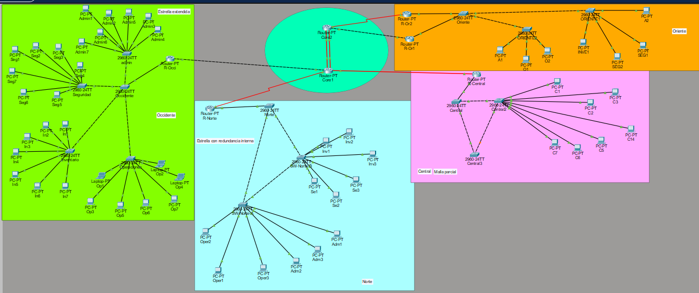
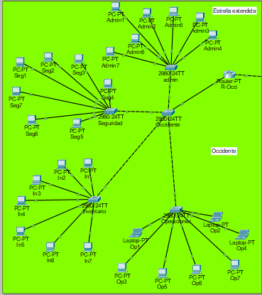
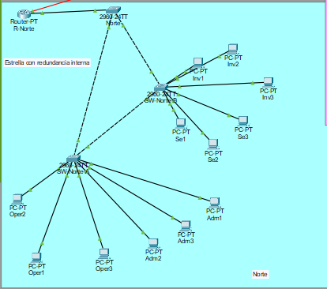
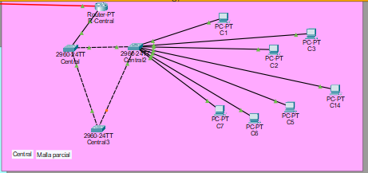
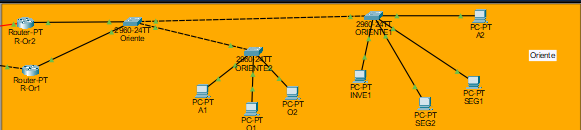
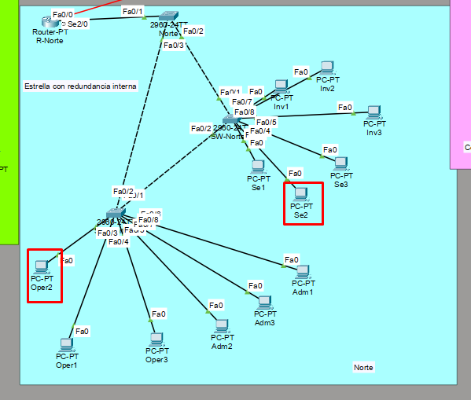
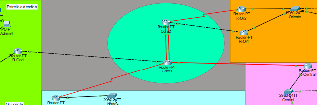

# Manual Técnico — Proyecto 2: Red Nacional de Coordinación SE-CONRED

**Universidad San Carlos de Guatemala**  
**Facultad de Ingeniería — Ingeniería en Ciencias y Sistemas**  
**Redes de Computadoras 1**  
**Carnet:** 202307499  

---

## Índice

1. [Descripción General](#1-descripción-general)
2. [Topología General](#2-topología-general)
3. [Backbone Core](#3-backbone-core)
4. [Sede Occidente](#4-sede-occidente)
5. [Sede Norte](#5-sede-norte)
6. [Sede Central](#6-sede-central)
7. [Sede Oriente](#7-sede-oriente)
8. [Tabla de VLANs](#8-tabla-de-vlans)
9. [Tablas de Subneteo](#9-tablas-de-subneteo)
10. [Configuraciones Importantes](#10-configuraciones-importantes)
11. [Pruebas de Conectividad](#11-pruebas-de-conectividad)
12. [Justificación Técnica de Topologías](#12-justificación-técnica-de-topologías)

---

## 1. Descripción General

Este proyecto implementa una infraestructura de red multisede para la **Secretaría Ejecutiva de la Coordinadora Nacional para la Reducción de Desastres (SE-CONRED)**, interconectando cuatro regiones operativas: Occidente, Norte, Oriente y Central, mediante un backbone nacional.

La solución integra:
- Segmentación mediante VLANs y enlaces troncales 802.1Q
- Propagación de VLANs mediante VTP
- Enrutamiento inter-VLAN con Router on a Stick
- Protocolos de enrutamiento dinámico: OSPF, EIGRP y RIP
- Rutas estáticas en el segmento Central
- Redundancia de enlace en el núcleo del backbone
- Alta disponibilidad de gateway mediante HSRP en Sede Oriente
- Rapid PVST+ en sedes con redundancia de capa 2
- Subneteo eficiente con VLSM

---

## 2. Topología General


**Medios físicos utilizados:**
- Fibra óptica: Core-1 ↔ R-Central
- Cable Ethernet (cruzado): Core-1 ↔ R-Occidente, Core-2 ↔ R-Oriente1
- Cable Serial: Core-1 ↔ R-Norte, Core-2 ↔ R-Oriente2
- Doble enlace Ethernet entre Core-1 y Core-2 (redundancia de enlace)

---

## 3. Backbone Core

### 3.1 Descripción

El backbone nacional interconecta las cuatro sedes mediante un núcleo conformado por dos routers de capa 3 (Core-1 y Core-2), conectados entre sí con doble enlace Ethernet para redundancia. Implementa tres protocolos de enrutamiento dinámico diferenciados y un segmento de rutas estáticas.

### 3.2 Dispositivos del Backbone

| Dispositivo | Función | Protocolo |
|-------------|---------|-----------|
| Core-1 | Núcleo principal, redistribución OSPF↔EIGRP | OSPF + EIGRP |
| Core-2 | Núcleo principal, redistribución EIGRP↔RIP | EIGRP + RIP |
| R-Occidente | Router de borde Sede Occidente | OSPF |
| R-Norte | Router de borde Sede Norte | OSPF |
| R-Oriente1 | Router de borde principal Sede Oriente | EIGRP + HSRP Activo |
| R-Oriente2 | Router de borde secundario Sede Oriente | RIP + HSRP Standby |
| R-Central | Router de borde Sede Central | Rutas estáticas |

### 3.3 Puntos de Redistribución

- **Core-1**: redistribuye OSPF ↔ EIGRP
- **Core-2**: redistribuye EIGRP ↔ RIP

### 3.4 Tabla de Direccionamiento del Backbone

| Enlace | Subred | Máscara | IP Core/Router1 | IP Router2 | Protocolo | Medio |
|--------|--------|---------|-----------------|------------|-----------|-------|
| Core-1 ↔ Core-2 (enlace 1) | 10.0.0.0/30 | 255.255.255.252 | 10.0.0.1 | 10.0.0.2 | Redundancia | Ethernet |
| Core-1 ↔ Core-2 (enlace 2) | 10.0.0.4/30 | 255.255.255.252 | 10.0.0.5 | 10.0.0.6 | Redundancia | Ethernet |
| Core-1 → R-Occidente | 10.0.0.8/30 | 255.255.255.252 | 10.0.0.9 | 10.0.0.10 | OSPF | Ethernet |
| Core-1 → R-Norte | 10.0.0.12/30 | 255.255.255.252 | 10.0.0.13 | 10.0.0.14 | OSPF | Serial |
| Core-2 → R-Oriente1 | 10.0.0.16/30 | 255.255.255.252 | 10.0.0.17 | 10.0.0.18 | EIGRP | Ethernet |
| Core-2 → R-Oriente2 | 10.0.0.20/30 | 255.255.255.252 | 10.0.0.21 | 10.0.0.22 | RIP | Serial |
| Core-1 → R-Central | 10.0.0.24/30 | 255.255.255.252 | 10.0.0.25 | 10.0.0.26 | Estático | Fibra |

---

## 4. Sede Occidente

### 4.1 Contexto
Centro regional de operaciones y abastecimiento. Coordina inventarios, personal operativo, seguridad física y administración regional.

### 4.2 Topología
Estrella extendida con 1 switch principal y 4 switches de acceso (uno por VLAN).



### 4.3 Switch Principal
- **Dispositivo:** SW-Occi-Principal
- **Rol VTP:** Server
- **Dominio VTP:** SECONRED
- **Root Bridge:** Sí (todas las VLANs)
- **Trunk hacia router:** Fa0/1
- **Trunks hacia acceso:** Fa0/2 (VLAN 19), Fa0/3 (VLAN 29→correcto: Fa0/5), Fa0/4 (VLAN 39), Fa0/5 (VLAN 49)

### 4.4 VLANs

| VLAN ID | Nombre | Equipos | Subred | Gateway |
|---------|--------|---------|--------|---------|
| 19 | Operaciones | 7 | 192.168.10.0/27 | 192.168.10.1 |
| 29 | Administracion | 7 | 192.168.10.32/27 | 192.168.10.33 |
| 39 | Seguridad | 7 | 192.168.10.64/27 | 192.168.10.65 |
| 49 | Inventario | 7 | 192.168.10.96/27 | 192.168.10.97 |

### 4.5 Enrutamiento Inter-VLAN
Router on a Stick en R-Occidente, interfaz Fa1/0 con subinterfaces dot1Q.

---

## 5. Sede Norte

### 5.1 Contexto
Centro regional de monitoreo y coordinación remota. Opera servicios sensibles con necesidad de tolerancia a fallos.

### 5.2 Topología
Estrella con redundancia interna — 1 switch principal y 2 switches de acceso interconectados entre sí para crear caminos redundantes gestionados por Rapid PVST+.



### 5.3 Switch Principal
- **Dispositivo:** SW-Norte-Principal
- **Rol VTP:** Server
- **Dominio VTP:** SECONRED
- **Root Bridge:** Sí (todas las VLANs)
- **Rapid PVST+:** Habilitado

### 5.4 VLANs

| VLAN ID | Nombre | Equipos | Subred | Gateway |
|---------|--------|---------|--------|---------|
| 19 | Operaciones | 3 | 192.168.20.0/27 | 192.168.20.1 |
| 29 | Administracion | 3 | 192.168.20.32/27 | 192.168.20.33 |
| 39 | Seguridad | 3 | 192.168.20.64/27 | 192.168.20.65 |
| 49 | Inventario | 3 | 192.168.20.96/27 | 192.168.20.97 |

### 5.5 Redundancia
El enlace directo entre SW-Norte-A y SW-Norte-B crea un bucle de capa 2 que Rapid PVST+ gestiona bloqueando el puerto redundante en condiciones normales y activándolo automáticamente ante una falla.

---

## 6. Sede Central

### 6.1 Contexto
Sede principal de servicios nacionales. Concentra administración superior, monitoreo institucional, soporte y servicios críticos.

### 6.2 Topología
Malla parcial con 3 switches interconectados entre sí, garantizando múltiples caminos y eliminando puntos únicos de falla.



### 6.3 Switch Principal
- **Dispositivo:** SW-Central-1
- **Rol VTP:** Server
- **Dominio VTP:** SECONRED
- **Root Bridge:** Sí (todas las VLANs)
- **Rapid PVST+:** Habilitado

### 6.4 VLANs

| VLAN ID | Nombre | Equipos | Subred | Gateway |
|---------|--------|---------|--------|---------|
| 29 | Administracion | 7 | 172.16.0.0/27 | 172.16.0.1 |
| 39 | Seguridad | 0 | 172.16.0.32/27 | 172.16.0.33 |
| 69 | Monitoreo-Control | 0 | 172.16.0.64/27 | 172.16.0.65 |
| 79 | Soporte | 0 | 172.16.0.96/27 | 172.16.0.97 |
| 89 | Servicios-Criticos | 0 | 172.16.0.128/27 | 172.16.0.129 |

### 6.5 Gateway
R-Central proporciona el gateway interno de todas las VLANs mediante subinterfaces dot1Q en Fa0/0.

---

## 7. Sede Oriente

### 7.1 Contexto
Sede regional de coordinación operativa. Requiere alta disponibilidad del gateway ante la caída de un equipo de borde.

### 7.2 Topología
1 switch principal y 2 switches de acceso, con **dos routers de borde** (R-Oriente1 y R-Oriente2) implementando HSRP para redundancia de gateway.




### 7.3 HSRP — Alta Disponibilidad del Gateway

| VLAN | IP Virtual (Gateway) | R-Oriente1 (Activo) | R-Oriente2 (Standby) | Prioridad Or1 | Prioridad Or2 |
|------|---------------------|--------------------|--------------------|---------------|---------------|
| 59 | 192.168.30.1 | 192.168.30.2 | 192.168.30.3 | 110 | 100 |
| 29 | 192.168.30.33 | 192.168.30.34 | 192.168.30.35 | 110 | 100 |
| 39 | 192.168.30.65 | 192.168.30.66 | 192.168.30.67 | 110 | 100 |
| 49 | 192.168.30.97 | 192.168.30.98 | 192.168.30.99 | 110 | 100 |

### 7.4 VLANs

| VLAN ID | Nombre | Equipos | Subred | Gateway Virtual |
|---------|--------|---------|--------|---------|
| 59 | Atencion-Regional | 2 | 192.168.30.0/27 | 192.168.30.1 |
| 29 | Administracion | 2 | 192.168.30.32/27 | 192.168.30.33 |
| 39 | Seguridad | 2 | 192.168.30.64/27 | 192.168.30.65 |
| 49 | Inventario | 1 | 192.168.30.96/27 | 192.168.30.97 |

---

## 8. Tabla de VLANs

| Sede | VLAN ID | Nombre | Red | Máscara | Gateway | VTP Mode |
|------|---------|--------|-----|---------|---------|----------|
| Occidente | 19 | Operaciones | 192.168.10.0 | 255.255.255.224 | 192.168.10.1 | Server |
| Occidente | 29 | Administracion | 192.168.10.32 | 255.255.255.224 | 192.168.10.33 | Server |
| Occidente | 39 | Seguridad | 192.168.10.64 | 255.255.255.224 | 192.168.10.65 | Server |
| Occidente | 49 | Inventario | 192.168.10.96 | 255.255.255.224 | 192.168.10.97 | Server |
| Norte | 19 | Operaciones | 192.168.20.0 | 255.255.255.224 | 192.168.20.1 | Server |
| Norte | 29 | Administracion | 192.168.20.32 | 255.255.255.224 | 192.168.20.33 | Server |
| Norte | 39 | Seguridad | 192.168.20.64 | 255.255.255.224 | 192.168.20.65 | Server |
| Norte | 49 | Inventario | 192.168.20.96 | 255.255.255.224 | 192.168.20.97 | Server |
| Oriente | 59 | Atencion-Regional | 192.168.30.0 | 255.255.255.224 | 192.168.30.1 (Virtual) | Client |
| Oriente | 29 | Administracion | 192.168.30.32 | 255.255.255.224 | 192.168.30.33 (Virtual) | Client |
| Oriente | 39 | Seguridad | 192.168.30.64 | 255.255.255.224 | 192.168.30.65 (Virtual) | Client |
| Oriente | 49 | Inventario | 192.168.30.96 | 255.255.255.224 | 192.168.30.97 (Virtual) | Client |
| Central | 29 | Administracion | 172.16.0.0 | 255.255.255.224 | 172.16.0.1 | Server |
| Central | 39 | Seguridad | 172.16.0.32 | 255.255.255.224 | 172.16.0.33 | Server |
| Central | 69 | Monitoreo-Control | 172.16.0.64 | 255.255.255.224 | 172.16.0.65 | Server |
| Central | 79 | Soporte | 172.16.0.96 | 255.255.255.224 | 172.16.0.97 | Server |
| Central | 89 | Servicios-Criticos | 172.16.0.128 | 255.255.255.224 | 172.16.0.129 | Server |

---

## 9. Tablas de Subneteo

### 9.1 Backbone — Red base: 10.0.0.0/8 — VLSM /30

| Enlace | Subred | Máscara | Prefijo | Rango utilizable | Broadcast |
|--------|--------|---------|---------|-----------------|-----------|
| Core-1↔Core-2 (1) | 10.0.0.0 | 255.255.255.252 | /30 | 10.0.0.1 – 10.0.0.2 | 10.0.0.3 |
| Core-1↔Core-2 (2) | 10.0.0.4 | 255.255.255.252 | /30 | 10.0.0.5 – 10.0.0.6 | 10.0.0.7 |
| Core-1→R-Occidente | 10.0.0.8 | 255.255.255.252 | /30 | 10.0.0.9 – 10.0.0.10 | 10.0.0.11 |
| Core-1→R-Norte | 10.0.0.12 | 255.255.255.252 | /30 | 10.0.0.13 – 10.0.0.14 | 10.0.0.15 |
| Core-2→R-Oriente1 | 10.0.0.16 | 255.255.255.252 | /30 | 10.0.0.17 – 10.0.0.18 | 10.0.0.19 |
| Core-2→R-Oriente2 | 10.0.0.20 | 255.255.255.252 | /30 | 10.0.0.21 – 10.0.0.22 | 10.0.0.23 |
| Core-1→R-Central | 10.0.0.24 | 255.255.255.252 | /30 | 10.0.0.25 – 10.0.0.26 | 10.0.0.27 |

### 9.2 Sede Occidente — Red base: 192.168.10.0/24 — VLSM /27

| VLAN | Subred | Máscara | Prefijo | Gateway | Rango utilizable | Broadcast |
|------|--------|---------|---------|---------|-----------------|-----------|
| 19 | 192.168.10.0 | 255.255.255.224 | /27 | 192.168.10.1 | 192.168.10.2 – 192.168.10.30 | 192.168.10.31 |
| 29 | 192.168.10.32 | 255.255.255.224 | /27 | 192.168.10.33 | 192.168.10.34 – 192.168.10.62 | 192.168.10.63 |
| 39 | 192.168.10.64 | 255.255.255.224 | /27 | 192.168.10.65 | 192.168.10.66 – 192.168.10.94 | 192.168.10.95 |
| 49 | 192.168.10.96 | 255.255.255.224 | /27 | 192.168.10.97 | 192.168.10.98 – 192.168.10.126 | 192.168.10.127 |

### 9.3 Sede Norte — Red base: 192.168.20.0/24 — VLSM /27

| VLAN | Subred | Máscara | Prefijo | Gateway | Rango utilizable | Broadcast |
|------|--------|---------|---------|---------|-----------------|-----------|
| 19 | 192.168.20.0 | 255.255.255.224 | /27 | 192.168.20.1 | 192.168.20.2 – 192.168.20.30 | 192.168.20.31 |
| 29 | 192.168.20.32 | 255.255.255.224 | /27 | 192.168.20.33 | 192.168.20.34 – 192.168.20.62 | 192.168.20.63 |
| 39 | 192.168.20.64 | 255.255.255.224 | /27 | 192.168.20.65 | 192.168.20.66 – 192.168.20.94 | 192.168.20.95 |
| 49 | 192.168.20.96 | 255.255.255.224 | /27 | 192.168.20.97 | 192.168.20.98 – 192.168.20.126 | 192.168.20.127 |

### 9.4 Sede Oriente — Red base: 192.168.30.0/24 — VLSM /27

| VLAN | Subred | Máscara | Prefijo | Gateway Virtual | Rango utilizable | Broadcast |
|------|--------|---------|---------|---------|-----------------|-----------|
| 59 | 192.168.30.0 | 255.255.255.224 | /27 | 192.168.30.1 | 192.168.30.2 – 192.168.30.30 | 192.168.30.31 |
| 29 | 192.168.30.32 | 255.255.255.224 | /27 | 192.168.30.33 | 192.168.30.34 – 192.168.30.62 | 192.168.30.63 |
| 39 | 192.168.30.64 | 255.255.255.224 | /27 | 192.168.30.65 | 192.168.30.66 – 192.168.30.94 | 192.168.30.95 |
| 49 | 192.168.30.96 | 255.255.255.224 | /27 | 192.168.30.97 | 192.168.30.98 – 192.168.30.126 | 192.168.30.127 |

### 9.5 Sede Central — Red base: 172.16.0.0/16 — VLSM /27

| VLAN | Subred | Máscara | Prefijo | Gateway | Rango utilizable | Broadcast |
|------|--------|---------|---------|---------|-----------------|-----------|
| 29 | 172.16.0.0 | 255.255.255.224 | /27 | 172.16.0.1 | 172.16.0.2 – 172.16.0.30 | 172.16.0.31 |
| 39 | 172.16.0.32 | 255.255.255.224 | /27 | 172.16.0.33 | 172.16.0.34 – 172.16.0.62 | 172.16.0.63 |
| 69 | 172.16.0.64 | 255.255.255.224 | /27 | 172.16.0.65 | 172.16.0.66 – 172.16.0.94 | 172.16.0.95 |
| 79 | 172.16.0.96 | 255.255.255.224 | /27 | 172.16.0.97 | 172.16.0.98 – 172.16.0.126 | 172.16.0.127 |
| 89 | 172.16.0.128 | 255.255.255.224 | /27 | 172.16.0.129 | 172.16.0.130 – 172.16.0.158 | 172.16.0.159 |

---

## 10. Configuraciones Importantes

### 10.1 Core-1 — OSPF + EIGRP + Redistribución
```
router ospf 1
 network 10.0.0.0 0.0.0.3 area 0
 network 10.0.0.4 0.0.0.3 area 0
 network 10.0.0.8 0.0.0.3 area 0
 network 10.0.0.12 0.0.0.3 area 0
 redistribute eigrp 100 subnets

router eigrp 100
 network 10.0.0.0 0.0.0.3
 network 10.0.0.4 0.0.0.3
 no auto-summary
 redistribute ospf 1 metric 10000 100 255 1 1500

ip route 172.16.0.0 255.255.0.0 10.0.0.26
```

### 10.2 Core-2 — EIGRP + RIP + Redistribución
```
router eigrp 100
 network 10.0.0.0 0.0.0.3
 network 10.0.0.4 0.0.0.3
 network 10.0.0.16 0.0.0.3
 no auto-summary
 redistribute rip metric 10000 100 255 1 1500

router rip
 version 2
 network 10.0.0.20
 no auto-summary
 redistribute eigrp 100 metric 5
```

### 10.3 R-Occidente — Router on a Stick
```
interface Fa1/0.19
 encapsulation dot1Q 19
 ip address 192.168.10.1 255.255.255.224

interface Fa1/0.29
 encapsulation dot1Q 29
 ip address 192.168.10.33 255.255.255.224

router ospf 1
 network 10.0.0.8 0.0.0.3 area 0
 network 192.168.10.0 0.0.0.31 area 0
 network 192.168.10.32 0.0.0.31 area 0
 network 192.168.10.64 0.0.0.31 area 0
 network 192.168.10.96 0.0.0.31 area 0
```

### 10.4 R-Oriente1 — HSRP Activo
```
interface Fa1/0.59
 encapsulation dot1Q 59
 ip address 192.168.30.2 255.255.255.224
 standby 1 ip 192.168.30.1
 standby 1 priority 110
 standby 1 preempt
```

### 10.5 SW-Occi-Principal — VTP Server + Trunks
```
vtp mode server
vtp domain SECONRED
vtp password cisco123

vlan 19
 name Operaciones
vlan 29
 name Administracion

interface Fa0/1
 switchport mode trunk
 switchport trunk allowed vlan 19,29,39,49

spanning-tree mode rapid-pvst
spanning-tree vlan 19,29,39,49 root primary
```

### 10.6 SW-Norte-A — VTP Client + Rapid PVST+
```
vtp mode client
vtp domain SECONRED
vtp password cisco123

interface Fa0/1
 switchport mode trunk
interface Fa0/2
 switchport mode trunk

spanning-tree mode rapid-pvst
```

---

## 11. Pruebas de Conectividad



-----------


---

## 12. Justificación Técnica de Topologías

### 12.1 Backbone
Se eligió una topología de núcleo dual con dos routers de capa 3 (Core-1 y Core-2) interconectados con doble enlace Ethernet, lo que proporciona redundancia física sin punto único de falla en el núcleo. La distribución de tres protocolos de enrutamiento (OSPF, EIGRP, RIP) en segmentos diferenciados permite demostrar interoperabilidad mediante redistribución de rutas, mientras que el segmento de rutas estáticas hacia Central garantiza control total sobre ese tráfico crítico.



### 12.2 Sede Occidente
Se eligió topología de estrella extendida porque responde directamente a las necesidades de administración centralizada, organización clara por departamentos y facilidad de mantenimiento. Un switch principal concentra el tráfico inter-VLAN y los switches de acceso por VLAN simplifican la administración y el crecimiento ordenado.


### 12.3 Sede Norte
Se implementó estrella con redundancia interna mediante un enlace directo entre los switches de acceso SW-Norte-A y SW-Norte-B. Esto crea caminos alternativos gestionados por Rapid PVST+, que bloquea el enlace redundante en operación normal y lo activa automáticamente ante una falla, reduciendo puntos únicos de falla y garantizando continuidad del servicio.


### 12.4 Sede Central
Se eligió malla parcial con 3 switches porque la sede principal requiere múltiples caminos de comunicación para servicios críticos y alta disponibilidad. Cada switch tiene al menos dos caminos hacia los demás, eliminando puntos únicos de falla. SW-Central-1 es el Root Bridge principal por ser el punto de conexión con el backbone.


### 12.5 Sede Oriente
Se implementó HSRP con dos routers de borde (R-Oriente1 activo, R-Oriente2 standby) para garantizar que la puerta de enlace predeterminada de las VLANs permanezca disponible ante la caída de cualquiera de los equipos de borde. Las PCs apuntan a la IP virtual HSRP, que es transparente a los cambios de router activo.


