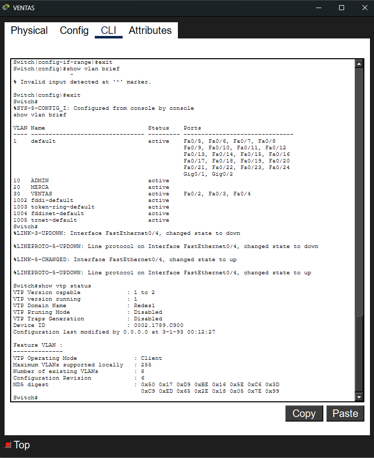
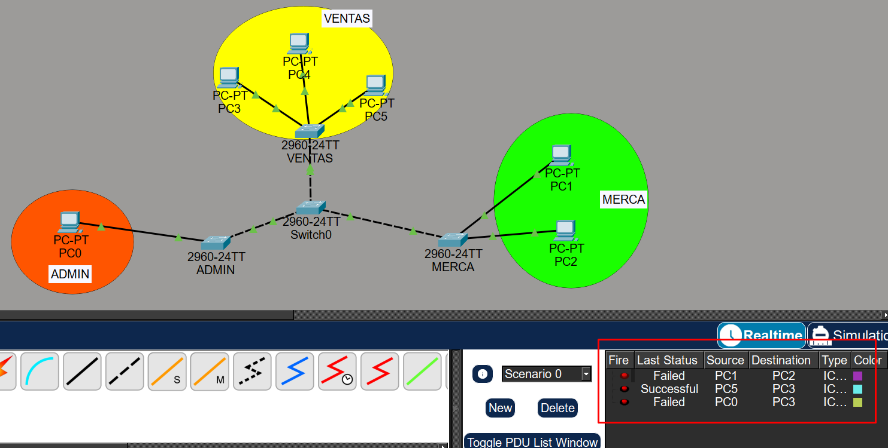
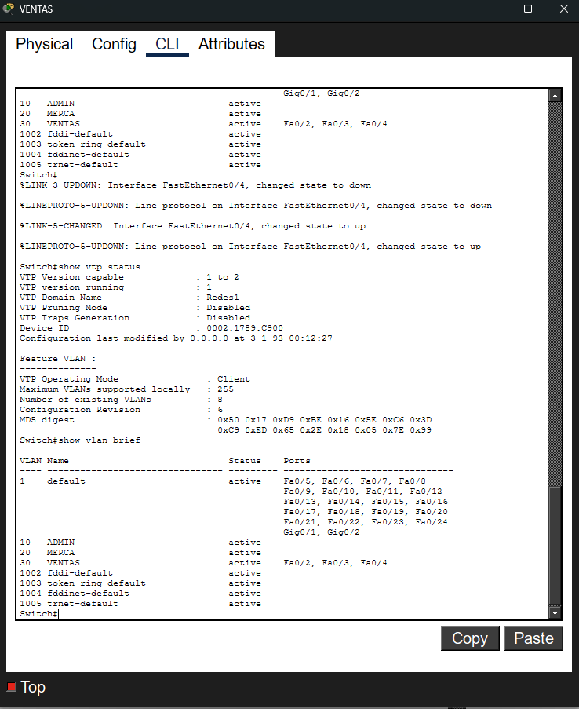

# Manual Técnico - Configuración de VTP y VLANs

## Información General
- **Fecha:** 27 de febrero de 2026
- **Curso:** Redes 1
- **Carnet:** 202307499
- **Tarea:** Tarea 3

---

## Índice
1. [Objetivo](#objetivo)
2. [Configuración del Switch](#configuración-del-switch)
3. [Scripts de Configuración](#scripts-de-configuración)
4. [Evidencia Gráfica](#evidencia-gráfica)

---

## Objetivo

El objetivo de esta configuración es implementar VTP (VLAN Trunking Protocol) en un switch Cisco, estableciendo un dominio VTP en modo servidor y creando VLANs para segmentar la red en diferentes grupos de usuarios.

---

## Configuración del Switch

### Descripción

La configuración implementada establece:
- **Dominio VTP:** Redes1
- **Modo VTP:** Server
- **VLAN 10:** ADMIN (Administradores)
- **VLAN 20:** ESTUDIANTES

### Componentes Configurados

1. **VTP Domain:** Define el dominio de administración de VLANs
2. **VTP Mode:** Establece el switch como servidor VTP (puede crear, modificar y eliminar VLANs)
3. **VLANs:** Segmentos lógicos de red para diferentes grupos de usuarios

---

## Scripts de Configuración

### Script 1 - Configuración VTP Server y VLANs

```bash
enable
configure terminal
vtp domain Redes1
vtp mode server
vlan 10
 name ADMIN
vlan 20
 name ESTUDIANTES
exit
```

---

### Script 2 - Configuración de Puertos Trunk

```bash
interface range FastEthernet 0/1 - 3
 switchport mode trunk
exit
```

---

### Script 3 - Configuración VTP Client y Asignación de Puertos

```bash
enable
configure terminal
vtp domain Redes1
vtp mode client
interface FastEthernet 0/1
 switchport mode trunk
exit
interface FastEthernet 0/2
 switchport mode access
 switchport access vlan 10
exit
interface range FastEthernet 0/3 - 4
 switchport mode access
 switchport access vlan 20
exit
```

---

## Evidencia Gráfica

### Configuración VTP




---

### Verificación de Conectividad




---

### Topología de Red



---

## Comandos de Verificación

Para verificar la configuración implementada, se pueden utilizar los siguientes comandos:

### Verificar Configuración VTP
```bash
show vtp status
```
Muestra un resumen de todas las VLANs configuradas en el switch, incluyendo:
- ID de VLAN
- Nombre
- Estado
- Puertos asignados

### Verificar Configuración Completa
```bash
show running-config
```
Muestra la configuración actual en ejecución del switch.


## Conclusión

La configuración VTP implementada permite una administración centralizada de VLANs en la red. El switch configurado como servidor VTP puede propagar cambios de VLANs a otros switches en el dominio "Redes1", facilitando la gestión de la red y reduciendo la posibilidad de errores de configuración.

Las VLANs creadas (ADMIN y ESTUDIANTES) proporcionan segmentación lógica de la red, mejorando la seguridad y el rendimiento al separar el tráfico de diferentes grupos de us